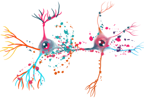
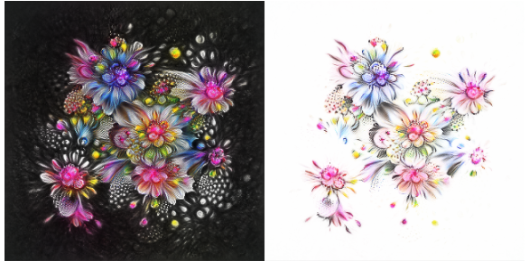

# Awesome AI: Drawing with Artificial Intelligence
Book by Kevin Ashley

This book is for anyone interested in AI and creativity: design, art, illustration, game creation, movies, animation, and other creative endeavors. My method is combining creativity and AI.

In the book you’ll find many illustrations and infographics created and augmented by artificial intelligence. In addition to this book, there’s also a supplemental art book called The Art of AI which includes real art created with artificial intelligence from several artists who participated in this project. 

- [Video Tutorials](http://ai-learning.vhx.tv) - Subscribe, updated weekly
- [The Art of AI](http://kevinashley.com/art-of-ai) – A yearly almanac of the art of AI and the artwork for this book
- [Instagram](http://instagram.com/awesomeai_art)

# Practical Projects for the Book

Please, use these supplemental materials and code for the video tutorial [Awesome AI: Drawing with Artificial Intelligence](http://ai-learning.vhx.tv). 

Most examples are available in playground environments like Google Colab and Binder. For standalone notebooks, it is recommended that your kernel environment is set to Python 3. Check [requirements.txt](requirements.txt) for dependencies. 

# Chapter 1. Getting Started

## Project 1.1 Drawing Sketches

In this project we begin by simply sketching a portrait, a pose of a human or an animal, and scene, a building or a landscape. Just draw anything you like, we'll use it later in the book. With this method by combining creativity and AI, we'll make beautiful illustrations, like these:

# Chapter 2. Creative Tools

## Project 2.1 Creative Tools and AI

In this project we begin by simply sketching a portrait, a pose of a human or an animal, and scene, a building or a landscape. Just draw anything you like, we'll use it later in the book.

- **Quick Draw** - Doodling with AI and predictive sketching. This is a great tool to understand how AI can predict what you are thinking to sketch! It also comes with Quick Draw dataset, collected from thousands of drawings! ( [Try it](https://quickdraw.withgoogle.com/) )
- **Photoshop Neural Filters**, and Adobe Sensei - is the classic digital tool’s window to AI creativity. Explore neural filters that Adobe engineers collected as part of Photoshop. ( [Article](https://helpx.adobe.com/photoshop/using/neural-filters.html) )
- **Clip Studio Paint AI Colorizing** – another classic illustration and drawing tool very popular with manga and anime artists. This tool includes AI colorizing that allows you to apply color to your sketches. We discuss AI based coloring in depth in this book. ( [Article](https://tips.clip-studio.com/en-us/articles/3939) )
- **Petalica Paint** ( [Try it](https://petalica-paint.pixiv.dev/index_en.html) )
- **OpenAI Microscope** – in this book we discuss neural networks. OpenAI came out with a great tool to visualize neural networks. This is a fantastic tool to understand how images get processed through different types of neural nets. ([Try it](https://openai.com/blog/microscope/))

## Project 2.2 Getting Started with Notebooks

- Getting Started with Notebooks - Style Transfer (  ) - this is a basic introduction to using an online Colab notebook. No installation required, but a GPU kernel recommended. Very easy code with just a few steps. 

# Chapter 3. Neural Networks

## Project 3.1 Create a Single Neuron

- Make a Single Neuron ()

## Project 3.2 Neural Networks

- Make a Simple Neural Network ()
- Activation Functions ()
- Visualizing Neurons ()
- Activation Atlas ([Article](https://ai.googleblog.com/2018/03/the-building-blocks-of-interpretability.html)| ) 

## Project 3.3 Neural Methods

- Classification ()
- Detection ()
- Segmentation ()

# Chapter 4. Drawing, Sketching and Painting 

## Project 4.1 Explore Sketching with AI

- **Quick Draw** - Doodling with AI and predictive sketching. This is a great tool to understand how AI can predict what you are thinking to sketch! It also comes with Quick Draw dataset, collected from thousands of drawings! ( [Try it](https://quickdraw.withgoogle.com/) )
- **Sketch RNN** ( [Try it](https://experiments.withgoogle.com/sketch-rnn-demo) )
- **Predicting the rest of the sketch** you can see a variety of different endings predicted by the model. ( [Try it](https://magenta.tensorflow.org/assets/sketch_rnn_demo/multi_predict.html) )
- **Morphing one sketch to another** the model will come up with new drawings that it believes to be the interpolation between the two original drawings ( [Try it](https://magenta.tensorflow.org/assets/sketch_rnn_demo/interp.html) )
- **Mimic your sketches** Rather than drawing a perfect duplicate copy of your drawing, the model will try to mimic your drawing instead. ( [Try it](https://magenta.tensorflow.org/assets/sketch_rnn_demo/multi_vae.html) )
- **Cartoonify** – turn your photo in a drawing, Google experiment ( [Try it](https://experiments.withgoogle.com/cartoonify) )

## Project 4.2 Inking, Refining and Colorizing Sketches

- Colorize Sketches ()
- Colorize Photos ()
- Colorize GrayScale ()
- Colorize Sketch to Grayscale ()

More on sketching... 

- Sketch Simplification ( [Paper](https://esslab.jp/~ess/en/research/sketch_master/) | [Code](https://github.com/bobbens/sketch_simplification) )
- Sketching Lines Refining ( [Code](https://github.com/hepesu/LineRelifer/) )
- Sketch based Deep Learning ( [Read more...](https://github.com/qyzdao/Sketch-Based-Deep-Learning) )

## Project 4.3 Shadow and Light

- Sketch from portraits (ArtLine) ( [Code](https://github.com/vijishmadhavan/ArtLine) | )
- Cartoons from Portraits ( [Code](https://github.com/vijishmadhavan/Toon-Me) |  )
- Pix2Pix (  | [Code](https://github.com/phillipi/pix2pix) | [Demo](https://affinelayer.com/pixsrv/) )
- ShadeSketch ( [Paper](https://arxiv.org/abs/2002.11812) | [Try it](https://qyzdao.github.io/ShadeSketch/) | [Code](https://github.com/qyzdao/ShadeSketch) )
- Design and technical sketches [Sketch Graph](https://github.com/PrincetonLIPS/SketchGraphs)
    
# Chapter 5. Faces and Expressions with AI

- Face Detection ([Notebook](Face.ipynb))
- Facial Landmarks and Attributes ([Notebook](Face.ipynb))
- Eyes ([Notebook](Face.ipynb))
- 3D Face Orientation ([Notebook](Face.ipynb))
- Emotions and Facial Expressions ([Notebook](Face.ipynb))
- Generate Faces ([Notebook](GenerateFaces.ipynb))
- Tips for applying AI to faces ([Notebook](Face.ipynb))

# Chapter 6. Body and Poses with AI

- Keypoints and joints with AI ([Notebook](Face.ipynb))
- Pose Estimation ([Notebook](Face.ipynb))
- Datasets 2D ([Notebook](Face.ipynb))
- Datasets 3D ([Notebook](Face.ipynb))
- Tips for using AI with human body ([Notebook](Face.ipynb))

# Chapter 7. Animation with AI

- First Order Motion Model for Image Animation ([Paper](https://arxiv.org/pdf/2003.00196.pdf))
- An Illusion of Life ([Book](https://www.amazon.com/gp/product/0786860707))
- Animator's Survival Kit ([Book](https://www.amazon.com/Animators-Survival-Kit-Principles-Classical/dp/086547897X))
- Pose Animator (Faces and Poses)([Article](https://blog.tensorflow.org/2020/05/pose-animator-open-source-tool-to-bring-svg-characters-to-life.html)|[Code](https://github.com/yemount/pose-animator)|[Demo](https://pose-animator-demo.firebaseapp.com/camera.html))
 

# Chapter 8. Scenes, Landscapes, Building and Architecture
 
- Landscape Painting with Generative Adversarial Networks ([Article](https://arxiv.org/abs/2011.05552))

# Chapter 2. Creativity with AI

## Project 2.1 Style Transfer

## Project 2.2 Compositions and Patterns

- Patterns (  | [Article](https://distill.pub/2018/differentiable-parameterizations/) )

- Transparency and Patterns ()

- Exaggerating Features (Cartoonification)  (  )

- Generate Anime Faces  (  )

- Activation Atlas ( 

- 
- 
- Style Transfer(|[Original Colab](https://colab.research.google.com/github/tensorflow/lucid/blob/master/notebooks/differentiable-parameterizations/style_transfer_2d.ipynb)|[Colab](https://colab.research.google.com/drive/1Yia9N6r3sMK04zjFAJUqD3GA4XPA4Qjz))

## Project 1.2 Explore Creativity

- Style Transfer (  ) 
- Style Transfer with Blending Proportions (  )
- Style Transfer Parametrizations (  )
- Generating Images with BigGAN (  )
- WikiArt Model Artwork Trained (  )
- Artwork Trained Model (  )

# Chapter 3. Creative AI Tools 

- Neural Network Visualization
    - OpenAI Microscope ([Try it](https://openai.com/blog/microscope/))
    - Activation Atlases ([Article](https://ai.googleblog.com/2018/03/the-building-blocks-of-interpretability.html)|[Colab](https://colab.research.google.com/github/tensorflow/lucid/blob/master/notebooks/activation-atlas/activation-atlas-simple.ipynb)) 
- Style Transfer
    - Fast Style Transfer ([Code](https://github.com/lengstrom/fast-style-transfer))
    - Generative Style Transfer ([Tensorflow](https://www.tensorflow.org/tutorials/generative/style_transfer))
- Generating Images from Text
    - Generating Images from Text ([DALL-E](https://openai.com/blog/dall-e))
- Generating Anime Faces    
  - Anime Faces Generation ([Article](https://www.gwern.net/TWDNE))
- Fashion
  - Fashion [Tool](https://app.runwayml.com/models/ALANIX/Fashion-Illustrations)|[Code](https://colab.research.google.com/drive/1zRt7bKlH6sHeo3anHwvVnz6Z_0YToWb7) 
- 3D Models
    - [Article](https://nv-tlabs.github.io/DIB-R/)

# The Art of AI

